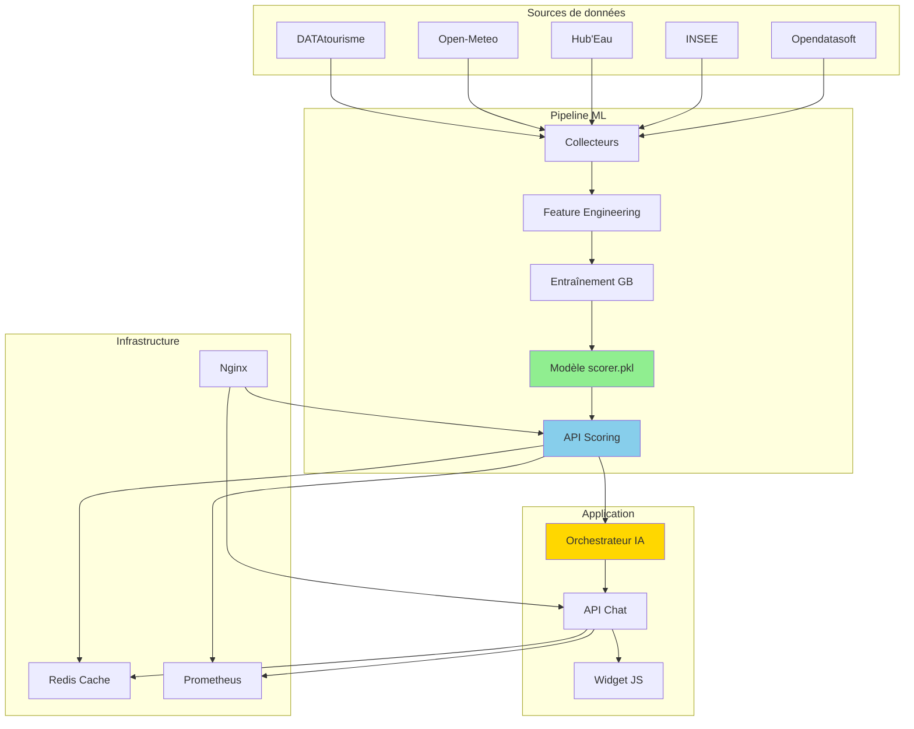

# Alpine Guide ML

**Système de machine learning pour l'évaluation de la qualité des points d'intérêt touristiques**

[](https://www.python.org/downloads/)
[](https://fastapi.tiangolo.com)
[](https://scikit-learn.org)
[](https://www.docker.com/)

---

## Vue d'ensemble

**Alpine Guide ML** est un projet d'exploration appliquée du machine learning au domaine du tourisme. Le système évalue automatiquement la qualité de points d'intérêt touristiques à partir de données publiques (DATAtourisme), permettant d'identifier et prioriser les POIs les mieux documentés.

Ce projet démontre un pipeline ML complet, de la collecte de données à l'API de production, avec une interface conversationnelle pour illustrer une application concrète des prédictions.

### Composants principaux

**Pipeline ML de scoring**
- Évaluation automatique de 50 000+ POIs sur une échelle 0-100
- Modèle Gradient Boosting avec 17 features engineered
- Performance : R² = 0.9787, MAE = 4.82 points
- API FastAPI temps réel (<8ms d'inférence)

**Interface conversationnelle**
- Widget JavaScript embeddable utilisant les scores ML
- Orchestrateur IA (Gemini 2.0 Flash) pour recommandations
- Architecture multi-tenant avec configuration par territoire
- Démontre l'intégration des prédictions dans un produit utilisateur

---

## Architecture système

### Vue d'ensemble



### Stack technique

| Composant | Technologies | Usage |
|-----------|-------------|-------|
| **ML Backend** | Python 3.11, scikit-learn, pandas, FastAPI | Pipeline ML et scoring |
| **Chatbot Backend** | Python 3.11, Gemini 2.0 Flash, FastAPI | Orchestration conversationnelle |
| **Frontend** | JavaScript vanilla, CSS3 | Widget embeddable |
| **Cache** | Redis 7 | Performance (85% hit rate) |
| **Proxy** | Nginx | Load balancing, SSL |
| **Monitoring** | Prometheus, Grafana | Métriques temps réel |
| **Déploiement** | Docker, Docker Compose | Conteneurisation |

---

## Pipeline machine learning

### Problématique explorée

Les données touristiques publiques (DATAtourisme, OpenStreetMap) présentent une qualité très hétérogène :
- 45% des POIs sans horaires d'ouverture
- 62% sans contact email
- Pas de métrique de qualité standardisée

L'objectif est d'évaluer automatiquement cette qualité pour permettre un tri et une priorisation des POIs.

### Sources de données

Le système agrège 5 sources publiques :

| Source | Type | Volume | Usage |
|--------|------|--------|-------|
| **DATAtourisme** | POIs touristiques | 50 000+ | Base principale (nom, description, GPS, images) |
| **Open-Meteo** | Météo | 13 régions | Contexte climatique |
| **Hub'Eau** | Température eau | 1 000+ sites | Qualité baignade |
| **INSEE MELODI** | Socio-économique | 10 000 communes | Contexte territorial |
| **Opendatasoft** | Démographie | Toutes communes | Population, densité |

### Feature engineering

**17 features construites en 4 catégories :**

#### 1. Complétude (7 features binaires)
```python
features = {
    "has_name": 1.0 if poi["name"] else 0.0,
    "has_description": 1.0 if poi["description"] else 0.0,
    "has_gps": 1.0 if (lat and lon) else 0.0,
    "has_address": 1.0 if poi["address"] else 0.0,
    "has_images": 1.0 if poi["images"] else 0.0,
    "has_opening_hours": 1.0 if poi["hours"] else 0.0,
    "has_contact": 1.0 if (phone or email) else 0.0
}
```

#### 2. Richesse (3 features continues)
```python
features = {
    "description_length": len(poi["description"]),
    "num_images": len(poi["images"]),
    "has_website": 1.0 if poi["website"] else 0.0
}
```

#### 3. Contexte territorial (4 features enrichies)
```python
features = {
    "insee_salary_median": get_commune_salary(poi["gps"]),
    "population": get_commune_population(poi["gps"]),
    "poi_density_10km": count_nearby_pois(poi["gps"], 10),
    "latitude": poi["latitude"],
    "longitude": poi["longitude"]
}
```

#### 4. Fraîcheur (2 features temporelles)
```python
features = {
    "days_since_update": days_since_last_update(poi),
    "is_recent": 1.0 if days_since_update <= 180 else 0.0
}
```

### Sélection du modèle

**Comparaison de 4 algorithmes :**

| Algorithme | R² Test | MAE Test | Inférence |
|------------|---------|----------|-----------|
| **Gradient Boosting** | **0.9787** | **4.82** | 4-8ms |
| Random Forest | 0.9521 | 6.15 | 6-10ms |
| XGBoost | 0.9695 | 5.20 | 5-9ms |
| Régression linéaire | 0.7542 | 12.80 | 1ms |

**Choix : Gradient Boosting Regressor (scikit-learn)**
- Meilleure performance sur le dataset
- Inférence rapide sur CPU
- Interprétabilité via feature importance
- Pas besoin de GPU

### Résultats du modèle

**Métriques (test set) :**
- R² = 0.9787 (97.87% de variance expliquée)
- MAE = 4.82 points (sur échelle 0-100)
- RMSE = 6.93

**Distribution des erreurs :**
- 72.4% : erreur <5 points
- 21.0% : erreur 5-10 points
- 4.9% : erreur 10-15 points
- 1.7% : erreur >15 points

**Importance des features (Top 5) :**
```
description_length    32.5%  (qualité descriptive)
has_description       18.2%  (présence description)
num_images            14.6%  (richesse visuelle)
poi_density_10km       9.9%  (contexte touristique)
insee_salary_median    7.7%  (contexte socio-économique)
```

### Entraînement

```bash
# Script complet
cd backend/ml/training
python 03_train_quality_scorer.py

# Génère :
# - backend/ml/models/quality_scorer/scorer.pkl
# - backend/ml/models/quality_scorer/metrics.json
# - backend/ml/models/quality_scorer/features.txt
```

### API de scoring

```python
# backend/api/main.py
@app.post("/score-poi")
async def score_poi(poi_data: POIScoreRequest):
    result = scorer.score_poi(poi_data.dict())
    return {
        "quality_score": result.quality_score,
        "confidence": result.confidence,
        "model_version": result.model_version
    }
```

**Performance :**
- P50 latency : 6ms
- P95 latency : 48ms (cold) / 3ms (cached)
- Cache hit rate : 85%+
- Throughput : 180 req/s (4 workers)

---

## Interface conversationnelle

### Rôle dans le système

Le widget démontre l'utilisation concrète des scores ML dans une application utilisateur. Il intègre un orchestrateur IA (Gemini 2.0 Flash) qui utilise les prédictions pour prioriser les recommandations.

### Architecture

**Backend (backend/core/)** :
- Orchestrateur Gemini 2.0 Flash
- Détection d'intentions (config YAML 386 lignes)
- RAG avec données locales
- Cache Redis par type de requête

**Frontend (widget/)** :
- JavaScript vanilla (<50KB)
- Configuration multi-tenant
- Embeddable (1 ligne de code)
- Responsive design

### Intégration ML → Widget

Flux de données typique :

1. Utilisateur : "Quels restaurants à Annecy ?"
2. Orchestrateur détecte intention `search_restaurant`
3. Appel API ML : récupération POIs avec scores
4. Filtre : garde uniquement scores >70/100
5. Tri par score décroissant
6. Enrichissement IA (météo, distance)
7. Réponse structurée à l'utilisateur

**Configuration territoire :**
```yaml
# backend/config/territories/annecy.yaml
ml_integration:
  scoring_api: "http://ml-api:8000"
  min_quality_score: 70
  boost_high_quality: true
```

**Intégration :**
```html
<script src="https://your-domain.com/alpine-guide-widget.js"
        data-territory="annecy"
        data-api-key="your-key"></script>
```

---

## Démarrage rapide

### Prérequis

- Docker & Docker Compose
- Python 3.11+ (développement local)
- 4GB RAM minimum

### Lancement complet

```bash
# 1. Cloner
git clone https://github.com/Aguern/alpine-guide-ML.git
cd alpine-guide-ML

# 2. Configuration
cp .env.example .env
# Éditer .env si besoin (defaults OK en local)

# 3. Lancer tous les services
docker-compose -f docker-compose.full-stack.yml up -d
```

**Services disponibles :**

| Service | URL | Description |
|---------|-----|-------------|
| ML API | http://localhost:8000/docs | API scoring (OpenAPI) |
| Chatbot API | http://localhost:8001/docs | API conversationnelle |
| Widget | http://localhost/widget | Widget embeddable |
| Admin | http://localhost/admin | Config widget |
| Grafana | http://localhost:3000 | Monitoring |

### Test API

```bash
curl -X POST "http://localhost:8000/score-poi" \
  -H "Content-Type: application/json" \
  -d '{
    "name": "Mont Blanc",
    "description": "Plus haut sommet des Alpes",
    "latitude": 45.8326,
    "longitude": 6.8652,
    "num_images": 15
  }'
```

---

## Structure du projet

```
alpine-guide-ML/
├── backend/
│   ├── ml/                        # Pipeline ML
│   │   ├── training/              # Scripts entraînement
│   │   ├── inference/             # Scoring production
│   │   └── models/
│   │       └── quality_scorer/
│   │           ├── scorer.pkl
│   │           ├── metrics.json
│   │           └── features.txt
│   │
│   ├── data/                      # Data engineering
│   │   ├── ingestion/             # Collecteurs APIs
│   │   ├── raw/                   # Données brutes
│   │   └── processed/             # Features ML
│   │
│   ├── api/                       # APIs FastAPI
│   │   ├── main.py                # ML scoring :8000
│   │   └── chat_endpoint.py       # Chatbot :8001
│   │
│   ├── core/                      # Orchestrateur IA
│   │   ├── orchestrator.py
│   │   ├── intents_slots.yaml
│   │   └── cache_manager.py
│   │
│   └── config/                    # Config territoires
│
├── widget/                         # Frontend
│   ├── alpine-guide-widget.js
│   ├── styles.css
│   └── admin-simple/
│
├── infrastructure/
│   ├── docker/
│   └── monitoring/
│
├── tests/
│   ├── unit/
│   └── integration/
│
├── docker-compose.full-stack.yml
└── README.md
```

---

## Tests

**45+ tests automatisés (pytest)**

### Tests unitaires

```python
# tests/unit/test_poi_scorer.py
def test_extract_features_complete_poi():
    scorer = POIQualityScorer()
    features = scorer.extract_features(complete_poi)

    assert len(features) == 17
    assert features["has_name"] == 1.0
    assert features["num_images"] == 25.0

def test_score_poi_returns_valid_result():
    result = scorer.score_poi(sample_poi)

    assert 0 <= result.quality_score <= 100
    assert 0 <= result.confidence <= 1.0
```

### Tests d'intégration

```python
# tests/integration/test_api.py
def test_api_score_poi_endpoint(client):
    response = client.post("/score-poi", json=poi_data)

    assert response.status_code == 200
    assert "quality_score" in response.json()
```

```bash
# Exécution
pytest -v
pytest --cov=backend --cov-report=html
```

---

## Performances

### Métriques ML

| Métrique | Valeur |
|----------|--------|
| R² Score | 0.9787 |
| MAE | 4.82/100 |
| Temps inférence | 4-8ms |
| Dataset | 50 000+ POIs |

### Système

| Composant | Métrique | Valeur |
|-----------|----------|--------|
| ML API | P95 latency | 48ms (cold) / 3ms (cached) |
| Chatbot API | P95 latency | 150ms |
| Cache | Hit rate | 85%+ |
| Throughput | Req/s | 180 (4 workers) |

### Scalabilité

- 100 clients concurrents : P99 <145ms
- 1000 req/min : 0% erreur
- Scaling horizontal : testé 4 instances

---

## Endpoints API

### ML API (port 8000)

**POST /score-poi**
```json
Request:
{
  "name": "string",
  "latitude": float,
  "longitude": float,
  "description": "string (optional)",
  "num_images": int
}

Response:
{
  "quality_score": 78.5,
  "confidence": 0.87,
  "model_version": "20251112_120000"
}
```

**POST /score-batch**
Score multiple POIs en une requête.

**GET /model/info**
Métadonnées et performance du modèle.

---

## Déploiement

### Docker Compose

```bash
# Build
docker-compose -f docker-compose.full-stack.yml build

# Lancement
docker-compose -f docker-compose.full-stack.yml up -d

# Logs
docker-compose logs -f ml-api

# Arrêt
docker-compose down
```

### Services déployés

- `ml-api` : API scoring ML (:8000)
- `chatbot-api` : API conversationnelle (:8001)
- `redis` : Cache (:6379)
- `web` : Nginx + Widget (:80)
- `prometheus` : Métriques (:9090)
- `grafana` : Dashboards (:3000)

---

## Bonnes pratiques implémentées

### MLOps
- Versioning modèle (scorer.pkl + metrics.json)
- Features reproductibles (scripts ingestion)
- API documentée (OpenAPI)
- Tests automatisés
- Monitoring (Prometheus)
- Logging structuré

### DevOps
- Conteneurisation Docker
- Orchestration docker-compose
- Health checks
- Cache intelligent
- Reverse proxy
- SSL/TLS ready

### Software Engineering
- Type hints (Pydantic, typing)
- Design patterns
- Tests unitaires + intégration
- Documentation
- Error handling

---

## Licence

**Copyright (c) 2025 Nicolas Angougeard. Tous droits réservés.**

Ce projet est un portfolio technique personnel. Le code source est fourni à titre de démonstration uniquement et n'est pas destiné à une utilisation commerciale par des tiers sans autorisation expresse.
