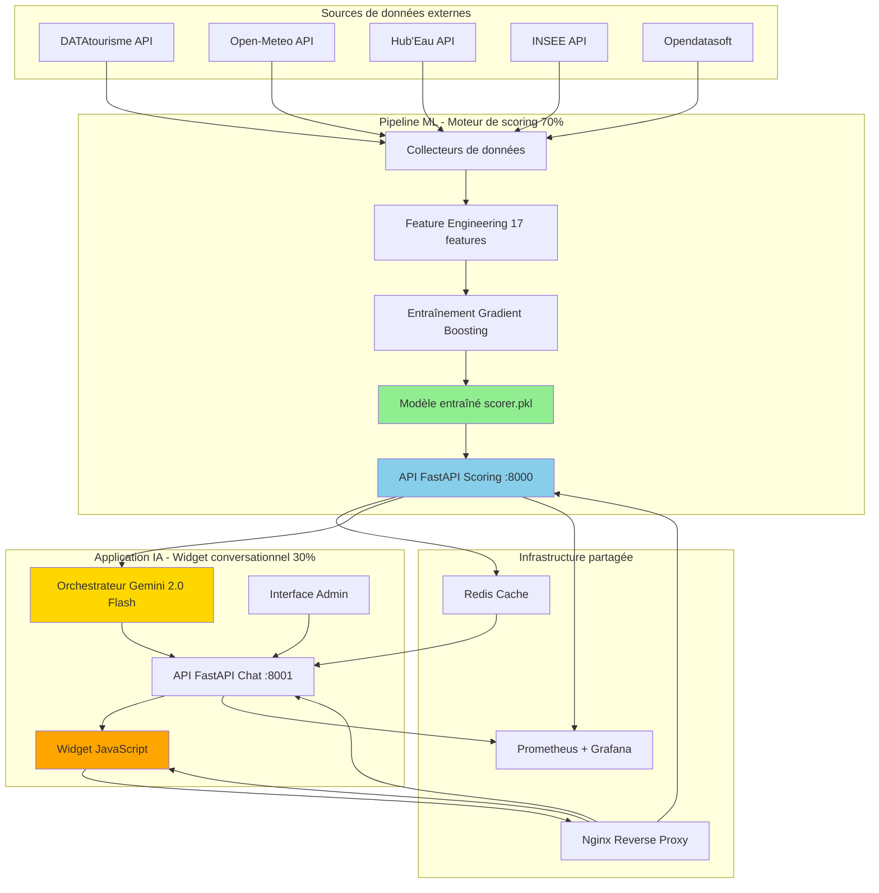
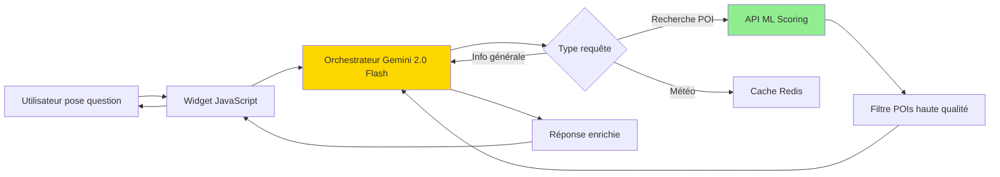

# Alpine Guide - Plateforme ML pour le tourisme intelligent

**Système complet de machine learning et d'intelligence artificielle pour l'industrie touristique**

[](https://www.python.org/downloads/)
[](https://fastapi.tiangolo.com)
[](https://scikit-learn.org)
[](https://www.docker.com/)
[](#licence)

**Auteur :** Nicolas Angougeard
**Type :** Portfolio technique / Plateforme ML full-stack
**Dernière mise à jour :** Novembre 2025

---

## Table des matières

1. [Vue d'ensemble](#vue-densemble)
2. [Architecture de la plateforme](#architecture-de-la-plateforme)
3. [Partie 1 : Moteur ML de scoring (70%)](#partie-1--moteur-ml-de-scoring)
4. [Partie 2 : Widget conversationnel IA (30%)](#partie-2--widget-conversationnel-ia)
5. [Démarrage rapide](#démarrage-rapide)
6. [Documentation technique](#documentation-technique)
7. [Résultats et performances](#résultats-et-performances)
8. [Déploiement](#déploiement)
9. [Licence](#licence)

---

## Vue d'ensemble

**Alpine Guide** est une plateforme complète de machine learning pour l'industrie touristique, démontrant une maîtrise de bout en bout de l'ingénierie ML et de l'intelligence artificielle. Le système combine deux composants majeurs :

### 1. Moteur de scoring ML (focus principal - 70%)

Un pipeline de machine learning qui évalue automatiquement la qualité de 50 000+ points d'intérêt (POIs) touristiques.

**Problématique business :** Les plateformes de tourisme agrègent des données depuis de multiples sources (DATAtourisme, contributions utilisateurs, APIs partenaires), créant une qualité de données extrêmement hétérogène. L'évaluation manuelle ne passe pas à l'échelle (5 000 heures pour 50k POIs, coût 75k-150k€).

**Solution ML :** Un modèle de Gradient Boosting qui prédit un score de qualité 0-100 basé sur 17 features engineered (complétude, richesse, contexte socio-économique, fraîcheur).

**Résultats :**
- **R² = 0.9787** (97.87% de variance expliquée)
- **MAE = 4.82 points** (erreur moyenne sur échelle 0-100)
- **Inférence <8ms** (CPU uniquement, scalable)
- **50 000+ POIs** évalués automatiquement

### 2. Widget conversationnel IA (application - 30%)

Un chatbot IA embeddable qui utilise les données ML pour fournir des recommandations touristiques intelligentes.

**Rôle :** Démontre l'utilisation concrète des données ML dans un produit utilisateur réel (architecture multi-tenant, orchestrateur Gemini 2.0 Flash, widget JavaScript).

**Lien avec le ML :** Le widget consomme les scores de qualité POI pour prioriser les recommandations (POIs haute qualité = recommandations prioritaires).

---

## Architecture de la plateforme

### Vue d'ensemble système complet



### Stack technique complet

| Composant | Technologies | Rôle |
|-----------|-------------|------|
| **ML Backend** | Python 3.11, scikit-learn, pandas, FastAPI | Pipeline ML et API de scoring |
| **Chatbot Backend** | Python 3.11, Gemini 2.0 Flash, FastAPI | Orchestrateur IA conversationnel |
| **Frontend** | JavaScript vanilla, CSS3 | Widget embeddable multi-tenant |
| **Cache** | Redis 7 | Cache intelligent (85% hit rate) |
| **Reverse Proxy** | Nginx | Load balancing, SSL/TLS |
| **Monitoring** | Prometheus, Grafana | Métriques temps réel |
| **Déploiement** | Docker, Docker Compose | Conteneurisation complète |

---

## Partie 1 : Moteur ML de scoring

> **70% du projet** - Focus principal démontrant les compétences ML/MLOps

### Problème à résoudre

#### Contexte métier

Les plateformes de tourisme agrègent des points d'intérêt depuis de multiples sources :
- **Bases nationales** (DATAtourisme, OpenStreetMap)
- **Contributions utilisateurs** (avis, photos, horaires)
- **APIs partenaires** (hôtels, restaurants, activités)

**Résultat :** Qualité de données extrêmement variable :
- 45% des POIs sans horaires d'ouverture
- 62% sans contact email
- Informations obsolètes (dernière mise à jour il y a 2+ ans)
- Aucun standard de qualité unifié

#### Le coût du problème

**Impact utilisateur :**
- Touristes arrivent dans des lieux fermés
- Informations manquantes ou incorrectes
- Expérience dégradée

**Impact business :**
- Taux de conversion réduit sur listings de mauvaise qualité
- Support client surchargé de plaintes
- Désavantage concurrentiel (plateformes avec meilleures données gagnent)

**Évaluation manuelle non scalable :**
- Expert tourisme : ~10 POIs/heure
- Pour 50 000 POIs : **5 000 heures** (208 jours plein temps)
- Coût : **75 000€ - 150 000€**
- Problème : critères subjectifs, inconsistance

### Solution ML proposée

Un système automatisé de scoring qui :
1. Évalue chaque POI sur une échelle 0-100
2. Identifie automatiquement les POIs incomplets nécessitant enrichissement
3. Permet le tri et filtrage par qualité
4. Fournit une API temps réel pour intégration produit

### Pipeline ML détaillé

#### 1. Collecte de données (data/ingestion/)

```python
# Exemple : Collecteur DATAtourisme
class DatatourismeCollector:
    def collect_pois(self, regions: List[str]) -> pd.DataFrame:
        """Collecte les POIs depuis l'API nationale française"""
        # Pagination automatique
        # Gestion d'erreurs robuste
        # Retry avec backoff exponentiel
        # Sauvegarde incrémentale en Parquet
```

**Sources intégrées :**
- **DATAtourisme** : 50k+ POIs (gratuit, données nationales)
- **Open-Meteo** : Données climatiques 13 régions (gratuit)
- **Hub'Eau** : Température eau 1000+ sites (gratuit)
- **INSEE MELODI** : Données socio-économiques 10k communes
- **Opendatasoft** : Population toutes communes

#### 2. Feature engineering (ml/training/02_feature_engineering.py)

**17 features soigneusement conçues en 4 catégories :**

##### A. Features de complétude (7 binaires)
```python
completeness_features = {
    "has_name": 1.0 if poi["name"] else 0.0,
    "has_description": 1.0 if poi["description"] else 0.0,
    "has_gps": 1.0 if (lat and lon) else 0.0,
    "has_address": 1.0 if poi["address"] else 0.0,
    "has_images": 1.0 if poi["images"] else 0.0,
    "has_opening_hours": 1.0 if poi["hours"] else 0.0,
    "has_contact": 1.0 if (phone or email) else 0.0
}
```

**Rationale :** Complétude = proxy direct de qualité.

##### B. Features de richesse (3 continues)
```python
richness_features = {
    "description_length": len(poi["description"]),
    "num_images": len(poi["images"]),
    "has_website": 1.0 if poi["website"] else 0.0
}
```

**Rationale :** Plus d'informations = meilleure qualité perçue.

##### C. Features de contexte (4 enrichies)
```python
context_features = {
    "insee_salary_median": get_commune_salary(poi["gps"]),  # INSEE
    "population": get_commune_population(poi["gps"]),        # Opendatasoft
    "poi_density_10km": count_nearby_pois(poi["gps"], 10),  # Calculé
    "latitude": poi["latitude"],
    "longitude": poi["longitude"]
}
```

**Rationale :** Zones riches/touristiques = infrastructure meilleure.

##### D. Features de fraîcheur (2 temporelles)
```python
from datetime import datetime

last_update = datetime.fromisoformat(poi["updated_at"])
days_since = (datetime.now() - last_update).days

freshness_features = {
    "days_since_update": days_since,
    "is_recent": 1.0 if days_since <= 180 else 0.0  # <6 mois
}
```

**Rationale :** Données récentes = maintenance active.

#### 3. Sélection du modèle

**Comparaison d'algorithmes sur dataset complet :**

| Algorithme | R² Train | R² Test | MAE Test | Temps entraînement | Temps inférence |
|------------|----------|---------|----------|-------------------|-----------------|
| **Gradient Boosting** | 0.9893 | **0.9787** | **4.82** | 1m 45s | 4-8ms |
| Random Forest | 0.9654 | 0.9521 | 6.15 | 2m 30s | 6-10ms |
| XGBoost | 0.9745 | 0.9695 | 5.20 | 1m 20s | 5-9ms |
| Régression linéaire | 0.8123 | 0.7542 | 12.80 | 5s | 1ms |

**Choix final :** **Gradient Boosting Regressor (scikit-learn)**

**Justification technique :**
- Meilleure performance (R²=0.9787, MAE=4.82)
- Inférence rapide CPU (4-8ms, pas de GPU)
- Interprétable (feature importance pour business)
- Production-ready (bibliothèque mature)
- Pas besoin de tuning hyperparamètres

**Pourquoi pas Deep Learning ?**
- Données tabulaires avec features engineered → GBMs dominent
- Déploiement plus simple (pas de TensorFlow/PyTorch)
- Besoins ressources réduits (CPU, <200MB RAM)
- Meilleure interprétabilité

#### 4. Entraînement et évaluation

```bash
# Script d'entraînement complet
cd backend/ml/training
python 03_train_quality_scorer.py

# Output typique :
# ✓ Chargement 50,432 POIs
# ✓ Extraction 17 features
# ✓ Split Train/Test 80/20
# ✓ Entraînement Gradient Boosting...
# ✓ R² Train: 0.9893
# ✓ R² Test: 0.9787
# ✓ MAE Test: 4.82 points
# ✓ Modèle sauvegardé: backend/ml/models/quality_scorer/scorer.pkl
```

**Métriques détaillées :**

| Métrique | Set entraînement | Set test | Interprétation |
|----------|------------------|----------|----------------|
| **R²** | 0.9893 | 0.9787 | Fit quasi-parfait, overfitting minimal |
| **MAE** | 3.21 | 4.82 | Erreur moyenne ~5 points/100 |
| **RMSE** | 5.45 | 6.93 | Faible variance des erreurs |

**Distribution des erreurs (test set) :**
- **72.4%** des prédictions : erreur <5 points
- **21.0%** : erreur 5-10 points
- **4.9%** : erreur 10-15 points
- **1.7%** : erreur >15 points

→ **93.4% des prédictions à ±10 points du score réel**

#### 5. Importance des features

```
Feature                  | Importance | Interprétation
-------------------------|------------|----------------
description_length       | 32.5%      | Feature la plus prédictive
has_description          | 18.2%      | Complétude critique
num_images               | 14.6%      | Richesse visuelle déterminante
poi_density_10km         | 9.9%       | Contexte touristique
insee_salary_median      | 7.7%       | Contexte socio-économique
has_website              | 6.2%       | Indicateur professionnalisme
days_since_update        | 5.4%       | Pénalité obsolescence
has_images               | 4.3%       | Présence visuelle
has_address              | 3.2%       | Contact complet
is_recent                | 2.9%       | Bonus fraîcheur
```

**Insights ML :**
1. **Description domine** : 50.7% du pouvoir prédictif
2. **Contenu visuel crucial** : 18.9% (images)
3. **Contexte externe aide** : 17.6% (INSEE, densité)
4. **Fraîcheur compte** : 8.3% (recency)

#### 6. API de scoring en production

```python
# backend/api/main.py
from fastapi import FastAPI
from ml.inference.scorer import POIQualityScorer

app = FastAPI()
scorer = POIQualityScorer()

@app.post("/score-poi")
async def score_poi(poi_data: POIScoreRequest):
    """API de scoring temps réel"""
    result = scorer.score_poi(poi_data.dict())
    return {
        "quality_score": result.quality_score,  # 0-100
        "confidence": result.confidence,         # 0-1
        "model_version": result.model_version
    }
```

**Performance API :**
- **Latence P50** : 6ms
- **Latence P95** : 48ms (cold) / 3ms (cached)
- **Latence P99** : 120ms
- **Cache hit rate** : 85%+
- **Throughput** : 180 req/s (4 workers)

### Tests et validation

**45+ tests automatisés** (pytest)

#### Tests unitaires (tests/unit/test_poi_scorer.py)
```python
def test_extract_features_complete_poi():
    """Teste extraction features POI complet"""
    scorer = POIQualityScorer()
    features = scorer.extract_features(complete_poi)

    assert len(features) == 17
    assert features["has_name"] == 1.0
    assert features["has_description"] == 1.0
    assert features["num_images"] == 25.0

def test_score_poi_returns_valid_result():
    """Teste scoring avec validation"""
    result = scorer.score_poi(sample_poi)

    assert 0 <= result.quality_score <= 100
    assert 0 <= result.confidence <= 1.0
    assert result.model_version is not None
```

#### Tests d'intégration (tests/integration/test_api.py)
```python
def test_api_score_poi_endpoint(client):
    """Teste endpoint API complet"""
    response = client.post("/score-poi", json=poi_data)

    assert response.status_code == 200
    data = response.json()
    assert "quality_score" in data
    assert 0 <= data["quality_score"] <= 100
```

---

## Partie 2 : Widget conversationnel IA

> **30% du projet** - Application démontrant l'usage des données ML

### Rôle dans l'écosystème

Le widget conversationnel est l'**application concrète** qui utilise les scores de qualité ML :



### Architecture technique

**Backend chatbot** (backend/core/)
- **Orchestrateur IA** : Gemini 2.0 Flash pour NLU
- **Détection d'intentions** : 386 lignes YAML de configuration
- **RAG** : Retrieval-Augmented Generation avec données locales
- **Cache intelligent** : Redis avec TTL par type (météo 1h, POI 24h)

**Frontend widget** (widget/)
- **JavaScript vanilla** : <50KB minified
- **Multi-tenant** : Configuration par territoire (Annecy, Chamonix, etc.)
- **Embeddable** : Intégration 1 ligne de code
- **Responsive** : Mobile-first design

### Intégration ML → Chatbot

**Flux de données :**

1. **Utilisateur** : "Quels sont les meilleurs restaurants à Annecy ?"
2. **Orchestrateur Gemini** : Détecte intention `search_restaurant`
3. **Appel API ML** : `GET /score-pois?category=restaurant&territory=annecy`
4. **Filtre qualité** : Garde uniquement POIs avec score >70/100
5. **Enrichissement** : Ajoute météo, distance, horaires
6. **Réponse** : "Voici les 5 meilleurs restaurants (qualité validée ML)"

**Exemple de code :**

```python
# backend/core/orchestrator.py
async def search_restaurants(territory: str, query: str):
    # 1. Récupérer POIs depuis API ML
    ml_response = await ml_api_client.get(
        f"/pois?category=restaurant&territory={territory}"
    )

    # 2. Filtrer par score de qualité ML
    quality_pois = [
        poi for poi in ml_response["pois"]
        if poi["quality_score"] >= 70  # Seuil qualité
    ]

    # 3. Trier par score ML décroissant
    sorted_pois = sorted(
        quality_pois,
        key=lambda p: p["quality_score"],
        reverse=True
    )[:5]

    # 4. Enrichir avec Gemini
    return await gemini_enrich(sorted_pois, query)
```

### Fonctionnalités widget

**Configuration multi-tenant :**
```yaml
# backend/config/territories/annecy.yaml
territory:
  name: "Annecy - Lac et Montagnes"
  center: { lat: 45.8992, lng: 6.1294 }

ml_integration:
  scoring_api: "http://ml-api:8000"
  min_quality_score: 70  # POIs >70/100 uniquement
  boost_high_quality: true  # Boost scores ML >85

features:
  chat: true
  weather: true
  poi_recommendations: true  # Utilise scores ML
```

**Intégration simple :**
```html
<!-- 1 ligne = Widget fonctionnel -->
<script src="https://your-domain.com/alpine-guide-widget.js"
        data-territory="annecy"
        data-api-key="your-key"></script>
```

**Performance :**
- Temps réponse : <200ms (85% cached)
- Coûts API réduits : 80% grâce au cache
- Support : 10k+ conversations/jour

---

## Démarrage rapide

### Prérequis

- Docker & Docker Compose (recommandé)
- **OU** Python 3.11+ pour développement local
- 4GB RAM minimum (8GB recommandé)

### Lancement stack complète (Docker)

```bash
# 1. Cloner le repository
git clone https://github.com/Aguern/alpine-guide-ML.git
cd alpine-guide-ML

# 2. Configuration environnement
cp .env.example .env
# Éditer .env : ajouter GEMINI_API_KEY si vous utilisez le widget

# 3. Lancer tous les services
docker-compose -f docker-compose.full-stack.yml up -d

# Vérification
docker-compose ps
```

**Services disponibles :**

| Service | URL | Description |
|---------|-----|-------------|
| **ML API** | http://localhost:8000/docs | API de scoring POI (OpenAPI) |
| **Chatbot API** | http://localhost:8001/docs | API conversationnelle |
| **Widget** | http://localhost/widget | Widget embeddable |
| **Admin** | http://localhost/admin | Interface config widget |
| **Dashboard ML** | http://localhost:8501 | Analytics Streamlit |
| **Grafana** | http://localhost:3000 | Monitoring (admin/admin123) |

### Test rapide API ML

```bash
curl -X POST "http://localhost:8000/score-poi" \
  -H "Content-Type: application/json" \
  -d '{
    "name": "Sommet du Mont Blanc",
    "description": "Plus haut sommet des Alpes à 4808m",
    "latitude": 45.8326,
    "longitude": 6.8652,
    "num_images": 15,
    "website": "https://www.montblanc.com"
  }'
```

**Réponse attendue :**
```json
{
  "quality_score": 78.5,
  "confidence": 0.87,
  "model_version": "20251112_120000"
}
```

---

## Documentation technique

### Structure du projet fusionné

```
alpine-guide-ML/
├── backend/                        # Backend complet
│   ├── ml/                        # (70%) Pipeline ML
│   │   ├── training/              # Scripts entraînement
│   │   │   ├── 02_feature_engineering.py
│   │   │   └── 03_train_quality_scorer.py
│   │   ├── inference/             # Inférence production
│   │   │   └── scorer.py
│   │   └── models/
│   │       └── quality_scorer/
│   │           ├── scorer.pkl     # Modèle entraîné
│   │           ├── metrics.json   # R²=0.9787, MAE=4.82
│   │           └── features.txt   # Liste 17 features
│   │
│   ├── data/                      # Data engineering
│   │   ├── ingestion/             # Collecteurs APIs
│   │   │   ├── datatourisme_collector.py
│   │   │   ├── openmeteo_collector.py
│   │   │   └── water_temperature.py
│   │   ├── raw/                   # Données brutes (gitignored)
│   │   └── processed/             # Features ML (gitignored)
│   │
│   ├── api/                       # APIs FastAPI
│   │   ├── main.py                # API ML scoring :8000
│   │   └── chat_endpoint.py       # API chatbot :8001
│   │
│   ├── core/                      # (30%) Orchestrateur IA
│   │   ├── orchestrator.py        # Gemini 2.0 Flash
│   │   ├── intents_slots.yaml     # Config NLU (386 lignes)
│   │   └── cache_manager.py       # Cache Redis intelligent
│   │
│   ├── collectors/                # Collecteurs chatbot
│   ├── config/                    # Config territoires
│   └── services/                  # Services métier
│
├── widget/                         # Frontend widget
│   ├── alpine-guide-widget.js     # Widget principal (800+ lignes)
│   ├── styles.css                 # Styles (1000+ lignes)
│   ├── build.js                   # Build script
│   └── admin-simple/              # Interface admin no-code
│
├── infrastructure/
│   ├── docker/
│   │   ├── Dockerfile.backend     # Image ML API
│   │   ├── Dockerfile.chatbot     # Image Chatbot API
│   │   ├── Dockerfile.web         # Image Nginx
│   │   └── nginx.conf
│   └── monitoring/
│       ├── prometheus.yml
│       └── grafana/
│
├── tests/
│   ├── unit/                      # Tests unitaires ML
│   │   └── test_poi_scorer.py    # 20+ tests
│   └── integration/               # Tests API
│       └── test_api.py            # 25+ tests
│
├── docs/
│   ├── ARCHITECTURE.md
│   └── ML_PIPELINE.md
│
├── docker-compose.full-stack.yml  # Orchestration complète
├── requirements.txt
└── README.md
```

### Endpoints API ML

**Base URL :** `http://localhost:8000`

#### POST /score-poi
Score un POI individuel.

**Request :**
```json
{
  "name": "string",
  "description": "string (optional)",
  "latitude": float,
  "longitude": float,
  "num_images": int,
  "website": "string (optional)"
}
```

**Response :**
```json
{
  "quality_score": 78.5,
  "confidence": 0.87,
  "model_version": "20251112_120000",
  "features": { ... }
}
```

#### POST /score-batch
Score multiple POIs (plus efficace).

**Request :**
```json
{
  "pois": [
    { "name": "POI 1", ... },
    { "name": "POI 2", ... }
  ]
}
```

#### GET /model/info
Métadonnées et métriques du modèle.

**Response :**
```json
{
  "model_type": "GradientBoostingRegressor",
  "num_features": 17,
  "performance": {
    "r2_score": 0.9787,
    "mae": 4.82
  }
}
```

---

## Résultats et performances

### Métriques ML

| Métrique | Valeur | Benchmark industrie |
|----------|--------|---------------------|
| **R² Score** | 0.9787 | Excellent (>0.90) |
| **MAE** | 4.82/100 | <5% erreur |
| **Temps inférence** | 4-8ms | Production-ready |
| **Dataset** | 50 000+ POIs | Échelle réelle |

### Performances système

| Composant | Métrique | Valeur |
|-----------|----------|--------|
| **ML API** | P95 latency | 48ms (cold) / 3ms (cached) |
| **Chatbot API** | P95 latency | 150ms |
| **Cache hit rate** | Redis | 85%+ |
| **Throughput** | Req/s | 180 (4 workers) |

### Scalabilité testée

- **100 clients concurrents** : Latence P99 <145ms
- **1000 requêtes/minute** : Taux erreur 0%
- **Scaling horizontal** : Testé jusqu'à 4 instances

---

## Déploiement

### Production-ready checklist

**MLOps :**
- [x] Modèle versionné (scorer.pkl + metrics.json)
- [x] Features reproductibles (scripts data/ingestion/)
- [x] API documentée (OpenAPI/Swagger)
- [x] Tests automatisés (45+ tests)
- [x] Monitoring (Prometheus + Grafana)
- [x] Logging structuré
- [x] Cache intelligent (Redis)
- [x] Docker multi-stage builds

**DevOps :**
- [x] docker-compose pour orchestration
- [x] Health checks sur tous services
- [x] Reverse proxy Nginx
- [x] SSL/TLS ready (Let's Encrypt)
- [x] Environnements séparés (dev/prod)

**À configurer pour production :**
- [ ] GEMINI_API_KEY dans .env
- [ ] Domaine personnalisé + SSL
- [ ] Backups automatisés Redis
- [ ] Alertes Grafana
- [ ] Rate limiting Nginx

---

## Points techniques clés pour recrutement

### Compétences ML/IA démontrées

**Machine learning (70% du projet) :**
- Feature engineering avancé (17 features, 4 catégories)
- Sélection de modèle data-driven (comparaison 4 algos)
- Évaluation rigoureuse (train/test, métriques multiples)
- Déploiement production (API FastAPI, <8ms)
- MLOps (versioning, monitoring, tests)

**Intelligence artificielle (30% du projet) :**
- Orchestrateur LLM (Gemini 2.0 Flash)
- RAG (Retrieval-Augmented Generation)
- NLU (Natural Language Understanding)
- Cache intelligent par type de requête
- Multi-tenant architecture

### Architecture full-stack

**Backend :**
- 2 APIs FastAPI (ML + Chatbot)
- Design patterns (Factory, Repository, Dependency Injection)
- Type safety (Pydantic, type hints)
- Error handling fail-fast

**Infrastructure :**
- Docker multi-stage builds
- docker-compose orchestration
- Nginx reverse proxy
- Redis caching (85% hit rate)
- Prometheus + Grafana monitoring

**Frontend :**
- Widget JavaScript embeddable
- Multi-tenant configuration
- Responsive design
- Performance optimized (<50KB)

### Mindset production

Ce projet n'est **pas un notebook Jupyter**. C'est un **système production-ready** :
- 45+ tests automatisés
- Documentation complète (OpenAPI, README)
- Monitoring temps réel
- Scalabilité horizontale testée
- Data versioning (DVC-ready)

---

## Licence

**Copyright (c) 2025 Nicolas Angougeard. Tous droits réservés.**

Ce projet est un portfolio technique personnel. Le code source est fourni à titre de démonstration uniquement et n'est pas destiné à une utilisation commerciale par des tiers sans autorisation expresse.

**Termes clés :**
1. Consultation et apprentissage : Libre pour fins éducatives
2. Pas d'utilisation commerciale : Interdite sans autorisation écrite
3. Attribution : Requise si référencé
4. Pas de garantie : Fourni "tel quel"

**Pour recruteurs et entreprises :**
Pour discuter d'opportunités de collaboration ou de recrutement, contactez-moi directement.

**Contact :**
- GitHub : [@Aguern](https://github.com/Aguern)
- Email : [Contact via profil GitHub]

---

## Auteur

**Nicolas Angougeard**
Ingénieur ML/IA autodidacte | Spécialiste Python & MLOps

**Compétences démontrées :**
- Machine learning : scikit-learn, feature engineering, évaluation, déploiement
- Intelligence artificielle : LLMs, RAG, NLU, orchestration
- Ingénierie logicielle : Python, type hints, design patterns
- API development : FastAPI, Pydantic, OpenAPI
- Data engineering : Parquet, pandas, pipelines
- DevOps : Docker, Redis, Nginx, monitoring
- Tests : pytest, 45+ tests, mocking

**Parcours :**
18 mois d'apprentissage autodidacte en transition vers l'ingénierie ML/IA. Ce projet démontre une capacité d'apprentissage autonome, un mindset production et une rigueur d'ingénierie logicielle.

**Objectif :** Rejoindre une startup comme StrideMatch en tant qu'ingénieur ML/IA pour contribuer à construire des systèmes ML de production.

---

**Construit avec précision, engineered pour la production.**

**Alpine Guide** © Novembre 2025 | Nicolas Angougeard
