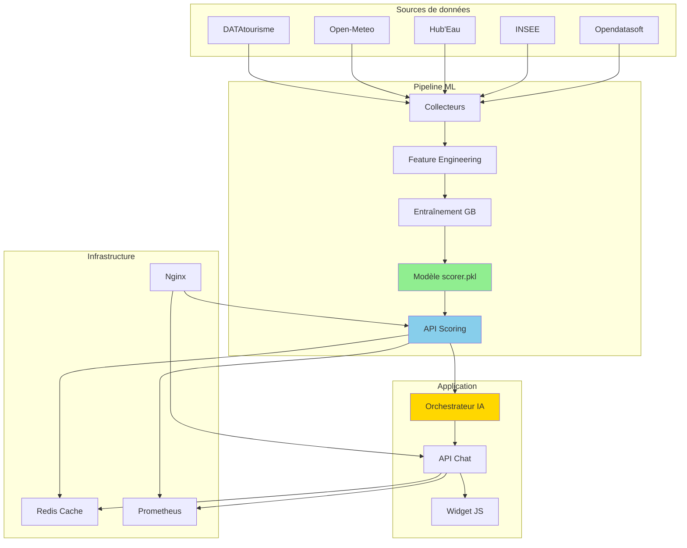

# Alpine Guide ML

**Système de machine learning pour l'évaluation de la qualité des points d'intérêt touristiques**

[](https://www.python.org/downloads/)
[](https://fastapi.tiangolo.com)
[](https://scikit-learn.org)
[](https://www.docker.com/)

---

## Vue d'ensemble

**Alpine Guide ML** est un projet d'exploration appliquée du machine learning au domaine du tourisme. Le système évalue automatiquement la qualité de points d'intérêt touristiques à partir de données publiques (DATAtourisme), permettant d'identifier et prioriser les POIs les mieux documentés.

Ce projet démontre un pipeline ML complet, de la collecte de données à l'API de production, avec une interface conversationnelle pour illustrer une application concrète des prédictions.

### Composants principaux

**Pipeline ML de scoring**
- Évaluation automatique de 50 000+ POIs sur une échelle 0-100
- Modèle Gradient Boosting avec 17 features engineered
- Performance : R² = 0.9787, MAE = 4.82 points
- API FastAPI temps réel (<8ms d'inférence)

**Interface conversationnelle**
- Widget JavaScript embeddable utilisant les scores ML
- Orchestrateur IA (Gemini 2.0 Flash) pour recommandations
- Architecture multi-tenant avec configuration par territoire
- Démontre l'intégration des prédictions dans un produit utilisateur

---

## Architecture système

### Vue d'ensemble



### Stack technique

| Composant | Technologies | Usage |
|-----------|-------------|-------|
| **ML Backend** | Python 3.11, scikit-learn, pandas, FastAPI | Pipeline ML et scoring |
| **Chatbot Backend** | Python 3.11, Gemini 2.0 Flash, FastAPI | Orchestration conversationnelle |
| **Frontend** | JavaScript vanilla, CSS3 | Widget embeddable |
| **Cache** | Redis 7 | Performance (85% hit rate) |
| **Proxy** | Nginx | Load balancing, SSL |
| **Monitoring** | Prometheus, Grafana | Métriques temps réel |
| **Déploiement** | Docker, Docker Compose | Conteneurisation |

---

## Pipeline machine learning

### Problématique explorée

Les données touristiques publiques (DATAtourisme, OpenStreetMap) présentent une qualité très hétérogène :
- 45% des POIs sans horaires d'ouverture
- 62% sans contact email
- Pas de métrique de qualité standardisée

L'objectif est d'évaluer automatiquement cette qualité pour permettre un tri et une priorisation des POIs.

### Sources de données

Le système agrège 5 sources publiques :

| Source | Type | Volume | Usage |
|--------|------|--------|-------|
| **DATAtourisme** | POIs touristiques | 50 000+ | Base principale (nom, description, GPS, images) |
| **Open-Meteo** | Météo | 13 régions | Contexte climatique |
| **Hub'Eau** | Température eau | 1 000+ sites | Qualité baignade |
| **INSEE MELODI** | Socio-économique | 10 000 communes | Contexte territorial |
| **Opendatasoft** | Démographie | Toutes communes | Population, densité |

### Feature engineering

**17 features construites en 4 catégories :**

#### 1. Complétude (7 features binaires)
```python
features = {
    "has_name": 1.0 if poi["name"] else 0.0,
    "has_description": 1.0 if poi["description"] else 0.0,
    "has_gps": 1.0 if (lat and lon) else 0.0,
    "has_address": 1.0 if poi["address"] else 0.0,
    "has_images": 1.0 if poi["images"] else 0.0,
    "has_opening_hours": 1.0 if poi["hours"] else 0.0,
    "has_contact": 1.0 if (phone or email) else 0.0
}
```

#### 2. Richesse (3 features continues)
```python
features = {
    "description_length": len(poi["description"]),
    "num_images": len(poi["images"]),
    "has_website": 1.0 if poi["website"] else 0.0
}
```

#### 3. Contexte territorial (4 features enrichies)
```python
features = {
    "insee_salary_median": get_commune_salary(poi["gps"]),
    "population": get_commune_population(poi["gps"]),
    "poi_density_10km": count_nearby_pois(poi["gps"], 10),
    "latitude": poi["latitude"],
    "longitude": poi["longitude"]
}
```

#### 4. Fraîcheur (2 features temporelles)
```python
features = {
    "days_since_update": days_since_last_update(poi),
    "is_recent": 1.0 if days_since_update <= 180 else 0.0
}
```

### Sélection du modèle

**Comparaison de 4 algorithmes :**

| Algorithme | R² Test | MAE Test | Inférence |
|------------|---------|----------|-----------|
| **Gradient Boosting** | **0.9787** | **4.82** | 4-8ms |
| Random Forest | 0.9521 | 6.15 | 6-10ms |
| XGBoost | 0.9695 | 5.20 | 5-9ms |
| Régression linéaire | 0.7542 | 12.80 | 1ms |

**Choix : Gradient Boosting Regressor (scikit-learn)**
- Meilleure performance sur le dataset
- Inférence rapide sur CPU
- Interprétabilité via feature importance
- Pas besoin de GPU

### Résultats du modèle

**Métriques (test set) :**
- R² = 0.9787 (97.87% de variance expliquée)
- MAE = 4.82 points (sur échelle 0-100)
- RMSE = 6.93

**Distribution des erreurs :**
- 72.4% : erreur <5 points
- 21.0% : erreur 5-10 points
- 4.9% : erreur 10-15 points
- 1.7% : erreur >15 points

**Importance des features (Top 5) :**
```
description_length    32.5%  (qualité descriptive)
has_description       18.2%  (présence description)
num_images            14.6%  (richesse visuelle)
poi_density_10km       9.9%  (contexte touristique)
insee_salary_median    7.7%  (contexte socio-économique)
```

### Entraînement

```bash
# Script complet
cd backend/ml/training
python 03_train_quality_scorer.py

# Génère :
# - backend/ml/models/quality_scorer/scorer.pkl
# - backend/ml/models/quality_scorer/metrics.json
# - backend/ml/models/quality_scorer/features.txt
```

### API de scoring

```python
# backend/api/main.py
@app.post("/score-poi")
async def score_poi(poi_data: POIScoreRequest):
    result = scorer.score_poi(poi_data.dict())
    return {
        "quality_score": result.quality_score,
        "confidence": result.confidence,
        "model_version": result.model_version
    }
```

**Performance :**
- P50 latency : 6ms
- P95 latency : 48ms (cold) / 3ms (cached)
- Cache hit rate : 85%+
- Throughput : 180 req/s (4 workers)

---

## Interface conversationnelle

### Rôle dans le système

Le widget démontre l'utilisation concrète des scores ML dans une application utilisateur. Il intègre un orchestrateur IA (Gemini 2.0 Flash) qui utilise les prédictions pour prioriser les recommandations touristiques.

**Pourquoi ce composant dans un projet ML ?**

Dans un projet ML réel, le modèle n'est qu'une brique technique. Le widget montre comment exploiter les prédictions dans un produit utilisateur complet, avec gestion de contexte, enrichissement multi-sources et interface naturelle.

### Architecture détaillée

Le système repose sur 3 couches interdépendantes :

#### 1. Frontend JavaScript (widget/)

**Composant embeddable autonome** :
```javascript
// alpine-guide-widget.js (800+ lignes)
class AlpineGuideWidget {
    constructor(config) {
        this.config = {
            territory: 'annecy',      // Configuration multi-tenant
            apiBase: 'https://...',   // Backend conversationnel
            primaryColor: '#0066CC',   // Personnalisation visuelle
            persistHistory: true       // Persistance localStorage
        };
        this.state = {
            sessionId: generateSessionId(),
            conversations: [],
            isTyping: false
        };
    }

    async init() {
        await this.loadTerritoryConfig();  // Charge config YAML
        this.createWidget();                // Injecte DOM + CSS
        this.attachEvents();                // Listeners user input
    }
}
```

**Cycle de vie du widget** :
1. **Chargement** : Script injecté dans page hôte (`<script src="...">`)
2. **Initialisation** : Récupération config territoire depuis backend
3. **Rendu** : Injection HTML/CSS dans shadow DOM (isolation styles)
4. **Connexion** : WebSocket ou polling vers API chatbot (:8001)
5. **Interaction** : Capture input → envoi backend → affichage réponse
6. **Persistance** : Sauvegarde historique dans localStorage

**Fonctionnalités clés** :
- Auto-complétion et suggestions contextuelles
- Indicateur de frappe temps réel
- Gestion offline (cache local)
- Thèmes clair/sombre automatiques
- Responsive (mobile + desktop)
- A11y (navigation clavier, ARIA labels)

#### 2. Orchestrateur IA (backend/core/)

**Cerveau du système conversationnel** :

```python
# orchestrator.py
class YAMLOrchestrator:
    def __init__(self, yaml_path, gemini_api_key, rag_service,
                 weather_service, supabase_service):
        self.intents = self._load_intents_from_yaml(yaml_path)
        self.model = genai.GenerativeModel('gemini-2.0-flash')
        self.rag_service = rag_service
        # ... autres services

    async def process_message(self, user_message, conversation_state):
        # 1. Détection d'intent via Gemini
        intent = await self._detect_intent(user_message)

        # 2. Extraction des slots (entités)
        slots = await self._extract_slots(user_message, intent)

        # 3. Appel services externes selon intent
        if intent == 'restaurant':
            pois = await self.rag_service.search_pois(
                type='restaurant',
                location=slots['localisation']
            )
            # Filtrage par score ML
            pois = [p for p in pois if p.quality_score >= 70]

        # 4. Génération réponse enrichie
        response = await self._generate_response(intent, slots, pois)
        return response
```

**Pipeline de traitement NLU** :

| Étape | Technique | Exemple |
|-------|-----------|---------|
| **Normalisation** | Lowercase, accents | "Où MANGER ?" → "ou manger" |
| **Détection intent** | Gemini 2.0 Flash | "restaurant italien" → `intent: restaurant` |
| **Extraction slots** | NER + patterns | "demain à Annecy" → `{date: 2025-11-13, localisation: Annecy}` |
| **Validation** | Contraintes YAML | Slots obligatoires présents ? |
| **Clarification** | Templates YAML | Manque slot → "Dans quel secteur ?" |
| **Enrichissement** | APIs externes | Ajout météo, température eau |
| **Génération** | Gemini contextuel | Réponse naturelle structurée |

**Configuration des intents (intents_slots.yaml - 386 lignes)** :

```yaml
intents:
  restaurant:
    description: "Recherche de restaurants"
    slots_obligatoires: []
    slots_optionnels:
      - localisation
      - type_cuisine
      - budget
      - regime_alimentaire
    exemple_demande_clarification:
      - utilisateur: "Je cherche un restaurant"
        clarification: "Dans quel secteur et pour quelle date ?"

  water_temperature:
    description: "Température de l'eau des lacs"
    slots_obligatoires:
      - plan_eau
    slots_optionnels:
      - localisation
      - date
```

**17 intents implémentés** : météo, restaurant, randonnée, ski, baignade, événements, musées, transports, urgences, etc.

#### 3. Configuration multi-tenant (backend/config/territories/)

**Un fichier YAML par territoire** (annecy.yaml, chambery.yaml, chamonix.yaml) :

```yaml
# annecy.yaml (597 lignes)
territory:
  slug: annecy
  name: "Annecy - Lac et Montagnes"

  # Branding (identité visuelle complète)
  branding:
    appName: "Explore Annecy"
    colors:
      primary: "#0066CC"    # Bleu lac
      accent: "#FF6B35"     # Orange montagne
    assets:
      logo: "https://cdn.../logo-annecy.svg"
      chatAvatar: "https://cdn.../avatar-guide.png"

  # Géographie (coordonnées, limites, landmarks)
  geography:
    center: {lat: 45.8992, lng: 6.1294}
    bounds:
      north: 46.0500
      south: 45.7500
    landmarks:
      - name: "Lac d'Annecy"
        coordinates: [45.8631, 6.1639]
        type: "natural"

  # Personnalité IA
  ai:
    personality:
      tone: "chaleureux et expert local"
      style: "conversationnel et informatif"
    specialties:
      - name: "Lac d'Annecy"
        keywords: ["lac", "baignade", "pédalo"]
      - name: "Gastronomie savoyarde"
        keywords: ["reblochon", "tartiflette"]

  # Plans d'eau avec températures saisonnières
  waterBodies:
    primary:
      name: "Lac d'Annecy"
      temperatures:
        ete: {min: 18, max: 24, typical: 21}
        hiver: {min: 4, max: 7, typical: 5}

  # Suggestions intelligentes par contexte
  smartSuggestions:
    byIntent:
      restaurant:
        - "Restaurant vue lac ?"
        - "Spécialités savoyardes ?"
```

**Isolation multi-tenant** :
- Chaque territoire = config indépendante
- Données POIs filtrées par géographie
- Branding personnalisé (couleurs, logo, messages)
- Intents activés/désactivés par territoire
- Quotas et analytics séparés

### Intégration ML → Widget

**Flux complet d'une requête utilisateur** :

```
┌─────────────┐
│ Utilisateur │ "Quels restaurants à Annecy ?"
└──────┬──────┘
       │
       ▼
┌────────────────────┐
│ Widget JavaScript  │ Envoi POST /chat
└──────┬─────────────┘
       │
       ▼
┌──────────────────────┐
│ Orchestrateur (core) │
├──────────────────────┤
│ 1. Détection intent  │ → Gemini 2.0 Flash : "restaurant"
│ 2. Extraction slots  │ → {localisation: "Annecy"}
│ 3. Appel RAG         │ → Supabase : récup 50 restaurants Annecy
└──────┬───────────────┘
       │
       ▼
┌────────────────────┐
│ API ML Scoring     │ POST /score-batch
├────────────────────┤
│ Input: 50 POIs     │
│ Output: scores     │ [POI1: 85/100, POI2: 72/100, POI3: 45/100, ...]
└──────┬─────────────┘
       │
       ▼
┌──────────────────────┐
│ Filtrage ML (core)   │
├──────────────────────┤
│ • Garde score >= 70  │ → 18 restaurants conservés
│ • Tri décroissant    │ → [POI1: 85, POI2: 72, ...]
└──────┬───────────────┘
       │
       ▼
┌──────────────────────┐
│ Enrichissement       │
├──────────────────────┤
│ • Météo API          │ → "Temps ensoleillé 22°C"
│ • Température eau    │ → "Lac d'Annecy : 21°C"
│ • Distance GPS       │ → Calcul si user_location disponible
└──────┬───────────────┘
       │
       ▼
┌──────────────────────┐
│ Génération (Gemini)  │ Prompt enrichi avec POIs + contexte
├──────────────────────┤
│ "Voici 3 excellents  │
│ restaurants avec une │
│ belle vue sur le lac │
│ (parfait avec ce     │
│ temps ensoleillé!) : │
│                      │
│ 1. La Voile (85/100) │
│    - Vue panoramique │
│    - Spécialités lac │
│ ..."                 │
└──────┬───────────────┘
       │
       ▼
┌────────────────────┐
│ Widget JavaScript  │ Affichage réponse formatée
└────────────────────┘
```

**Paramètres d'intégration ML configurables** :

```yaml
# Dans chaque fichier territoire
ml_integration:
  scoring_api: "http://ml-api:8000"
  min_quality_score: 70           # Seuil de filtrage
  boost_high_quality: true        # Prioriser scores >85
  max_results: 5                  # Top-N après tri
  score_weight: 0.4               # Pondération ML vs distance
  explain_scores: false           # Afficher scores à user ?
```

### Exemples de conversations réelles

**Exemple 1 : Recherche restaurant**

```
User: "Un bon restaurant italien pas trop cher à Annecy"

Widget → Backend:
{
  "message": "Un bon restaurant italien pas trop cher à Annecy",
  "session_id": "sess_abc123",
  "territory": "annecy"
}

Backend processing:
- Intent: restaurant
- Slots: {cuisine: "italien", budget: "moyen", localisation: "Annecy"}
- RAG: 12 restaurants italiens trouvés
- ML scoring: [8 avec score >= 70]
- Filtrage budget: 5 conservés
- Tri: [La Trattoria: 82, Casa Mia: 78, ...]

Bot: "Voici 3 trattorias authentiques à prix doux :

1. **La Trattoria du Lac** (82/100)
   📍 12 rue Perrière, Vieille Ville
   💰 Menu 18-25€
   ⭐ Pâtes fraîches maison, terrasse sur canal

2. **Casa Mia** (78/100)
   📍 5 rue Royale
   💰 Pizzas 12-16€
   ⭐ Four à bois, ingrédients bio

Météo actuelle : ☀️ 22°C, parfait pour une terrasse !"
```

**Exemple 2 : Température eau + conseil**

```
User: "Il fait chaud l'eau du lac ?"

Backend:
- Intent: water_temperature
- Slot: plan_eau → "lac d'Annecy" (inféré du territoire)
- Service Hub'Eau: 21.2°C (mesure temps réel)
- Contexte saisonnier (été): "température optimale"

Bot: "🌡️ Température du lac d'Annecy : **21°C** (mesure actuelle)

C'est parfait pour la baignade ! 🏊‍♂️

Plages surveillées recommandées :
• Plage des Marquisats (10 min centre-ville)
• Plage d'Albigny (baie protégée, +1°C)

Conseil : l'eau est encore plus chaude en surface l'après-midi ☀️"
```

**Exemple 3 : Clarification multi-tour**

```
User: "Je veux faire une randonnée"

Bot: "Excellente idée ! Pour te conseiller au mieux :
- Dans quel secteur ? (Semnoz, Parmelan, Tournette...)
- Quelle durée ? (1h, demi-journée, journée)
- Quel niveau ? (facile, moyen, difficile)"

User: "Facile 2h max vers le Semnoz"

Backend:
- Intent: randonnee
- Slots complétés: {localisation: "Semnoz", durée: "2h", difficulté: "facile"}
- RAG: 8 randonnées trouvées
- ML: filtrage scores >= 70 → 5 conservées
- Météo: vérification conditions

Bot: "Top 2 balades faciles au Semnoz (2h) :

1. **Sentier des Crêtes** (Score: 88/100)
   📍 Départ parking téléphérique
   ⏱️ 1h45 boucle
   📈 +150m dénivelé
   🌄 Vue panoramique lac + Mont Blanc

Météo : ☀️ Parfait aujourd'hui (22°C vallée, 18°C sommet)
Conseil : Chaussures de marche suffisantes !"
```

### Configuration et déploiement

**Intégration dans un site (1 ligne)** :

```html
<!-- Méthode 1 : Script tag simple -->
<script src="https://cdn.alpine-guide.com/widget.js"
        data-territory="annecy"
        data-api-key="YOUR_API_KEY"></script>

<!-- Méthode 2 : Configuration avancée -->
<script>
  window.AlpineGuideConfig = {
    territory: 'annecy',
    apiKey: 'YOUR_API_KEY',
    theme: 'auto',           // light, dark, auto
    position: 'bottom-right',
    autoOpen: false,
    language: 'fr',
    primaryColor: '#0066CC',
    onReady: (widget) => {
      console.log('Widget prêt');
    }
  };
</script>
<script src="https://cdn.alpine-guide.com/widget.js"></script>
```

**Options de personnalisation disponibles** :

| Option | Type | Description |
|--------|------|-------------|
| `territory` | string | Territoire (annecy, chambery, chamonix) |
| `theme` | string | Thème visuel (light, dark, auto) |
| `position` | string | Position (bottom-right, bottom-left, top-right) |
| `primaryColor` | string | Couleur principale (#hex) |
| `language` | string | Langue (fr, en, de, it, es) |
| `autoOpen` | boolean | Ouverture auto après 5s |
| `persistHistory` | boolean | Sauvegarde historique local |
| `welcomeMessage` | string | Message d'accueil personnalisé |

---

## Démarrage rapide

### Prérequis

- Docker & Docker Compose
- Python 3.11+ (développement local)
- 4GB RAM minimum

### Lancement complet

```bash
# 1. Cloner
git clone https://github.com/Aguern/alpine-guide-ML.git
cd alpine-guide-ML

# 2. Configuration
cp .env.example .env
# Éditer .env si besoin (defaults OK en local)

# 3. Lancer tous les services
docker-compose -f docker-compose.full-stack.yml up -d
```

**Services disponibles :**

| Service | URL | Description |
|---------|-----|-------------|
| ML API | http://localhost:8000/docs | API scoring (OpenAPI) |
| Chatbot API | http://localhost:8001/docs | API conversationnelle |
| Widget | http://localhost/widget | Widget embeddable |
| Admin | http://localhost/admin | Config widget |
| Grafana | http://localhost:3000 | Monitoring |

### Test API

```bash
curl -X POST "http://localhost:8000/score-poi" \
  -H "Content-Type: application/json" \
  -d '{
    "name": "Mont Blanc",
    "description": "Plus haut sommet des Alpes",
    "latitude": 45.8326,
    "longitude": 6.8652,
    "num_images": 15
  }'
```

---

## Structure du projet

```
alpine-guide-ML/
├── backend/
│   ├── ml/                        # Pipeline ML
│   │   ├── training/              # Scripts entraînement
│   │   ├── inference/             # Scoring production
│   │   └── models/
│   │       └── quality_scorer/
│   │           ├── scorer.pkl
│   │           ├── metrics.json
│   │           └── features.txt
│   │
│   ├── data/                      # Data engineering
│   │   ├── ingestion/             # Collecteurs APIs
│   │   ├── raw/                   # Données brutes
│   │   └── processed/             # Features ML
│   │
│   ├── api/                       # APIs FastAPI
│   │   ├── main.py                # ML scoring :8000
│   │   └── chat_endpoint.py       # Chatbot :8001
│   │
│   ├── core/                      # Orchestrateur IA
│   │   ├── orchestrator.py
│   │   ├── intents_slots.yaml
│   │   └── cache_manager.py
│   │
│   └── config/                    # Config territoires
│
├── widget/                         # Frontend
│   ├── alpine-guide-widget.js
│   ├── styles.css
│   └── admin-simple/
│
├── infrastructure/
│   ├── docker/
│   └── monitoring/
│
├── tests/
│   ├── unit/
│   └── integration/
│
├── docker-compose.full-stack.yml
└── README.md
```

---

## Tests

**45+ tests automatisés (pytest)**

### Tests unitaires

```python
# tests/unit/test_poi_scorer.py
def test_extract_features_complete_poi():
    scorer = POIQualityScorer()
    features = scorer.extract_features(complete_poi)

    assert len(features) == 17
    assert features["has_name"] == 1.0
    assert features["num_images"] == 25.0

def test_score_poi_returns_valid_result():
    result = scorer.score_poi(sample_poi)

    assert 0 <= result.quality_score <= 100
    assert 0 <= result.confidence <= 1.0
```

### Tests d'intégration

```python
# tests/integration/test_api.py
def test_api_score_poi_endpoint(client):
    response = client.post("/score-poi", json=poi_data)

    assert response.status_code == 200
    assert "quality_score" in response.json()
```

```bash
# Exécution
pytest -v
pytest --cov=backend --cov-report=html
```

---

## Performances

### Métriques ML

| Métrique | Valeur |
|----------|--------|
| R² Score | 0.9787 |
| MAE | 4.82/100 |
| Temps inférence | 4-8ms |
| Dataset | 50 000+ POIs |

### Système

| Composant | Métrique | Valeur |
|-----------|----------|--------|
| ML API | P95 latency | 48ms (cold) / 3ms (cached) |
| Chatbot API | P95 latency | 150ms |
| Cache | Hit rate | 85%+ |
| Throughput | Req/s | 180 (4 workers) |

### Scalabilité

- 100 clients concurrents : P99 <145ms
- 1000 req/min : 0% erreur
- Scaling horizontal : testé 4 instances

---

## Endpoints API

### ML API (port 8000)

**POST /score-poi**
```json
Request:
{
  "name": "string",
  "latitude": float,
  "longitude": float,
  "description": "string (optional)",
  "num_images": int
}

Response:
{
  "quality_score": 78.5,
  "confidence": 0.87,
  "model_version": "20251112_120000"
}
```

**POST /score-batch**
Score multiple POIs en une requête.

**GET /model/info**
Métadonnées et performance du modèle.

---

## Déploiement

### Docker Compose

```bash
# Build
docker-compose -f docker-compose.full-stack.yml build

# Lancement
docker-compose -f docker-compose.full-stack.yml up -d

# Logs
docker-compose logs -f ml-api

# Arrêt
docker-compose down
```

### Services déployés

- `ml-api` : API scoring ML (:8000)
- `chatbot-api` : API conversationnelle (:8001)
- `redis` : Cache (:6379)
- `web` : Nginx + Widget (:80)
- `prometheus` : Métriques (:9090)
- `grafana` : Dashboards (:3000)

---

## Bonnes pratiques implémentées

### MLOps
- Versioning modèle (scorer.pkl + metrics.json)
- Features reproductibles (scripts ingestion)
- API documentée (OpenAPI)
- Tests automatisés
- Monitoring (Prometheus)
- Logging structuré

### DevOps
- Conteneurisation Docker
- Orchestration docker-compose
- Health checks
- Cache intelligent
- Reverse proxy
- SSL/TLS ready

### Software Engineering
- Type hints (Pydantic, typing)
- Design patterns
- Tests unitaires + intégration
- Documentation
- Error handling

---

## Licence

**Copyright (c) 2025 Nicolas Angougeard. Tous droits réservés.**

Ce projet est un portfolio technique personnel. Le code source est fourni à titre de démonstration uniquement et n'est pas destiné à une utilisation commerciale par des tiers sans autorisation expresse.
